<!--
  Every image below is a self-contained SVG built by scripts/ (see AGENTS.md).
  The hero and the nayots.com plate nest official, unaltered nayots brand marks.
  Only plain image tags are ever wrapped in links; never nest a picture element inside a
  link (GitHub's sanitizer lifts the image out of the picture and the theme swap dies).
-->

  

  I build software end to end: .NET services, AWS and the infrastructure under them, 
  the front ends people actually use, and the AI tooling that speeds all of it up. 
  <i>ad astra per aspera</i>

  

  

  

  

 

  <picture>
    <source media="(prefers-color-scheme: dark)" srcset="assets/brand/nayots-n-on-dark.svg">
    <source media="(prefers-color-scheme: light)" srcset="assets/brand/nayots-n-on-light.svg">
    
  </picture>

  <a href="https://nayots.com">nayots.com</a>
  &nbsp;·&nbsp;
  <a href="https://www.linkedin.com/in/grigorov-stoyan/">linkedin</a>

